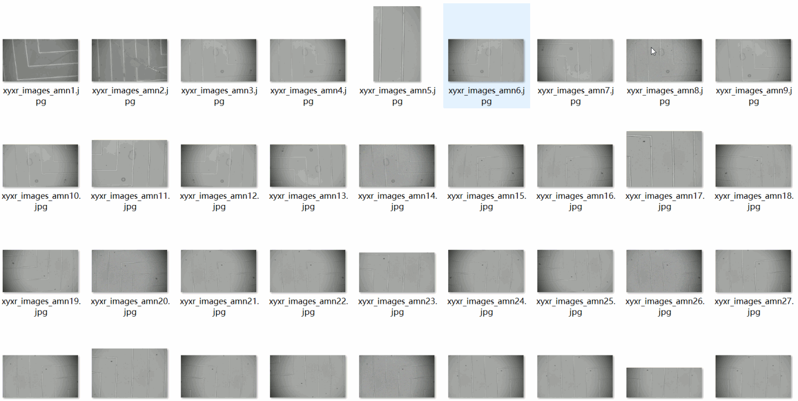
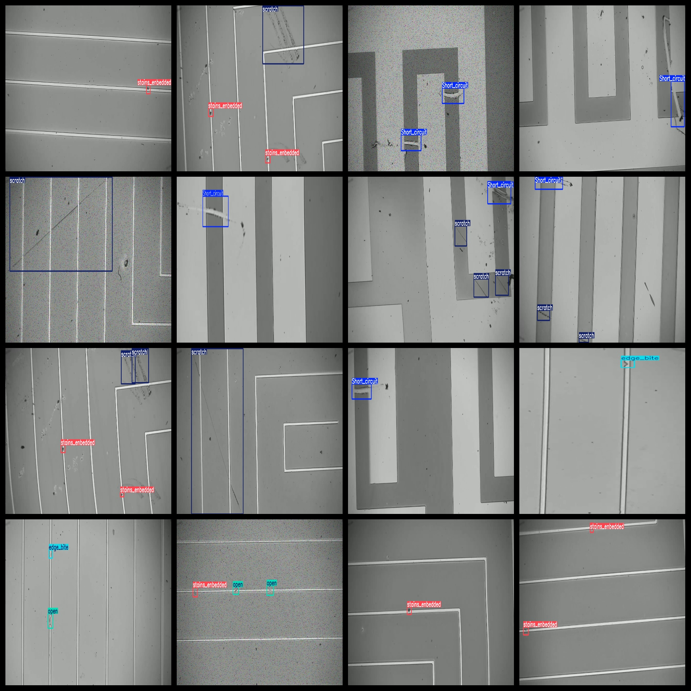

# [Object Detection] Semiconductor Wafer Defect Dataset 6174 imagesYOLO+VOC format

Dataset Format: VOC format + YOLO format

The compressed file contains: three folders, each storing images, xml files, and text files.

Total jpg images in JPEGImages folder: 6174

The total number of XML files in the "Annotations" folder: 6174.

The total number of txt files in the labels folder is 6174.

Total number of tag types: 7

Tag names: ["Short_circuit","edge_bite","gray_line","open","scratch","short_cricuit","stains_enbedded"]

The number of boxes for each label (Note that the order of labels in the Yolo format does not correspond to this, but is based on the classes.txt file in the labels folder):

Short_circuit frame count = 1821

edge_bite frame count = 1182

gray_line frame count = 1187

open frame count = 1152

scratch frame count = 3105

short_cricuit frame count = 4

stains_enbedded frame count = 3494

Total boxes: 11945

Picture clarity (Resolution: Pixels): Clear

Is the image enhanced: No

Shape of the label: Rectangular box, used for object detection and recognition.

Important Note: None

Special Notice: This dataset does not guarantee the accuracy or precision of the trained models or weight files. The dataset only provides accurate and reasonable annotations.

Annotation example:

Image overview:

## Images

---

Here is a pay link on Stripe (https://buy.stripe.com/3cs8yP7sY87d0vu9AB). Please contact me lonlonago@foxmail.com after funding $89, and I will send you a complete data files, thank you!

